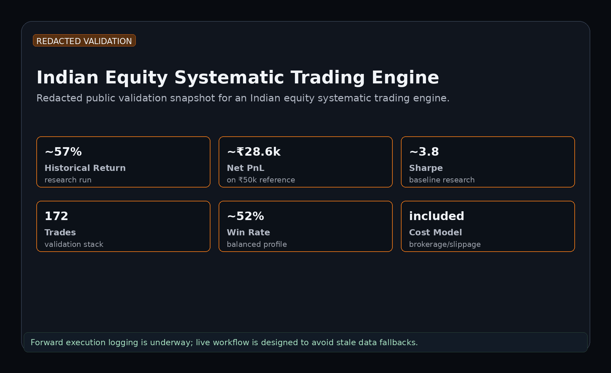
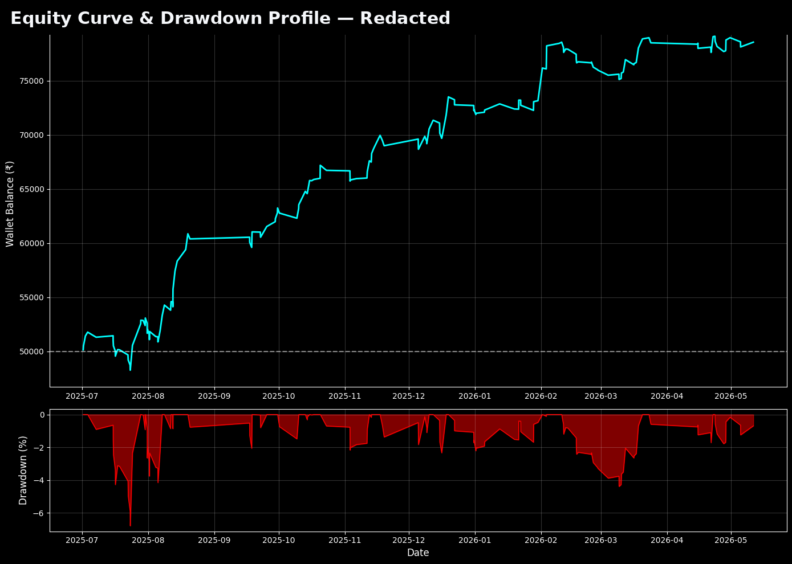

# Indian Equity Systematic Trading Engine

A redacted public case study for an Indian equity systematic trading engine.

This is a public, redacted portfolio case study. It shows the research process, validation structure, and risk framework without releasing the strategy implementation.

## Maintainer

**Shikhar Agrawal**  
Contact: `shikhar.quant@gmail.com`

## Current Status

Built and historically tested. Forward execution logging is underway to review Indian market costs, spreads, slippage, order handling, and broker/API behavior.

## High-Level Strategy Concept

The engine looks for short-term systematic opportunities in liquid Indian equities. It uses a structured signal process, regime checks, and risk controls before entering trades.

The exact implementation is private.

## Public Validation Snapshot

| Area | Public Summary |
|---|---:|
| Historical backtest return | ~57% research run after assumed costs |
| Net PnL reference | ~Rs. 28.6k on Rs. 50k reference |
| Sharpe profile | ~3.8 baseline research |
| Bootstrap 5% return | ~28.5% |
| Parameter stability | 27/27 tested configurations profitable |
| Forward execution review | cost and slippage logging underway |

These are historical research results, not future guarantees. Forward execution logging is used to review spreads, slippage, fills, order handling, and broker/API behavior.

## Visual Assets

- `validation_snapshot.png` - India validation snapshot
- `equity_curve_drawdown_redacted.png` - Equity curve and drawdown profile
- `monte_carlo_paths_redacted.png` - Monte Carlo path test
- `bootstrap_distribution_redacted.png` - Bootstrap distribution
- `parameter_stability_heatmap_redacted.png` - Parameter stability heatmap
- `robustness_summary_table.png` - Robustness summary table

## Validation Framework

- Historical backtesting
- In-sample / out-of-sample style checks
- Cost sensitivity
- Risk-control review
- Parameter stability review
- No-lookahead style audit where applicable
- Monte Carlo / path-dependency checks where applicable
- Bootstrap / resampling checks where applicable
- Forward execution logging for spreads, fills, slippage, and broker/API behavior

## Market-Specific Notes

Indian equities need extra attention to brokerage structure, statutory charges, STT/GST impact, circuit limits, API reliability, order rejections, intraday margin rules, and actual spread/slippage behavior. The public repo keeps broker/data plumbing generalized for IP safety.

## Risk Controls

- Hard loss control
- Break-even protection where applicable
- Trailing stop where applicable
- Time-based exits
- Session controls
- Regime filters
- Trade lockout after poor behavior where applicable
- Execution monitoring during forward tests

## What Is Not Public

- Exact tickers
- Exact parameters
- Exact signal formulas
- Source code
- Broker/API execution code
- Full trade ledger
- Raw notebooks
- Live deployment logic

## Contact & Licensing

For licensing inquiries, private demos, custom strategy work, or collaboration:

- Email: `shikhar.quant@gmail.com`

Private strategy details are not shared publicly. Any deeper review, live deployment, or custom build requires a separate written agreement.

## Disclaimer

This repository is a redacted research/portfolio case study. It is not investment advice, a solicitation to buy or sell securities, or a guarantee of future performance.
